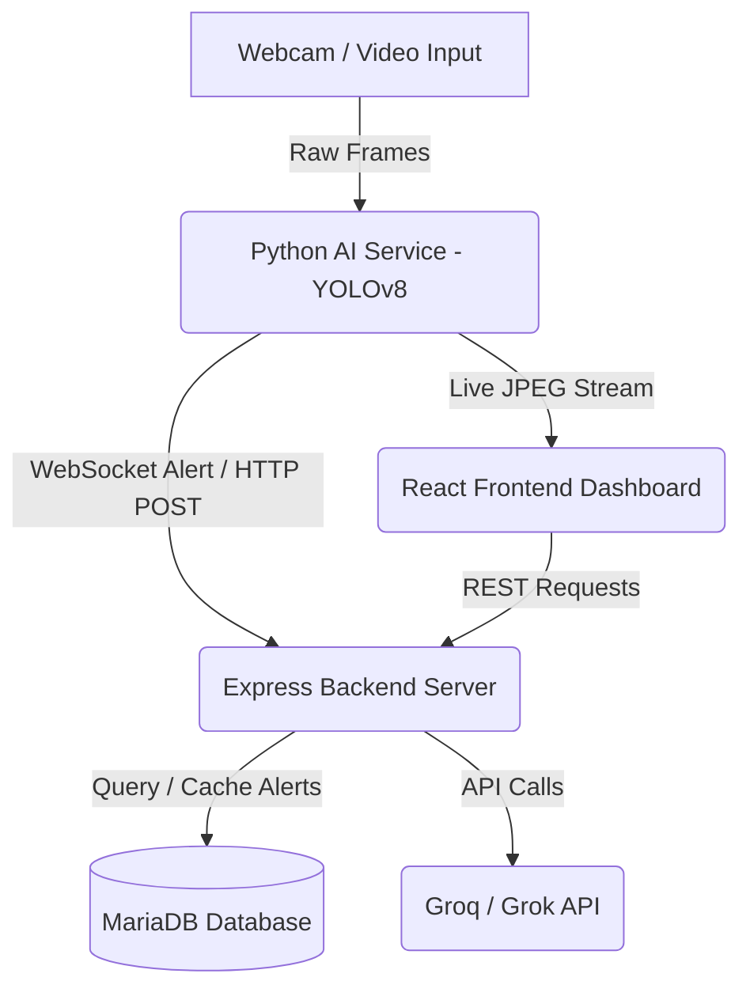

# AI Smart Surveillance System with Grok AI Security Assistant

An advanced, real-time smart surveillance system that integrates computer vision (YOLOv8 tracking) with Generative AI (Grok/Groq LLMs) to provide automated security logging, real-time threat detection, behavior auditing, and an interactive security assistant chatbot.

---

## 🏗️ System Architecture

The project consists of three main components communicating in real-time:



1. **Python AI Service (`ai-service`)**:
   - Reads webcam input and runs YOLOv8 tracking on restricted zone areas.
   - Logs events to a raw text file (`logs/events.txt`).
   - Forwards intrusion events to the Node.js backend and broadcasts live alert feeds via WebSockets.
2. **Express Backend (`backend`)**:
   - Manages alerts storage and database operations using MariaDB.
   - Communicates with the Groq API (using `llama-3.3-70b-versatile` by default) to handle chat history and behavioral audit generation.
3. **React Frontend (`frontend`)**:
   - Displays a live video feed, raw logs, database records, and provides the Grok Security Assistant interface.

---

## ✨ Features

- **📹 Live Stream with Restricted Zone Overlay**: Renders real-time camera feeds highlighting zone intrusion events.
- **🚨 Automated Database Alert Logging**: Safely stores intruder information, confidence ratings, timestamps, and cropped image snapshots.
- **🧠 Grok Security Assistant Chatbot**: Allows security officers to query historical database logs in natural language (e.g., *"Which intruder had the highest confidence score today?"*).
- **📋 Behavior Audit Reports**: Generates professional threat level assessments, chronological movement timelines, and security patrol recommendations based on tracking data.

---

## 🚀 Setup & Getting Started

### 📋 Prerequisites
- **Node.js** (v18 or higher)
- **Python** (v3.10 or higher)
- **Docker Desktop**
- **Groq API Key** (or Grok key)

---

### 1. 🗄️ Database Setup
The database is run via a Docker MariaDB container. Start the container:
```bash
docker start surveillance-mariadb
```
*Note: The database runs on port `3307` externally, mapped to port `3306` inside the container.*

---

### 2. 🔌 Backend Server Configuration
1. Navigate to the `backend` folder:
   ```bash
   cd backend
   ```
2. Create or edit the `.env` file and configure the parameters:
   ```env
   PORT=5001
   DB_HOST=127.0.0.1
   DB_PORT=3307
   DB_NAME=surveillance_db
   DB_USER=root
   DB_PASSWORD=root
   GROQ_API_KEY=your_groq_api_key_here
   ```
3. Install dependencies:
   ```bash
   npm install
   ```
4. Start the server:
   ```bash
   node server.js
   ```

---

### 3. 🐍 Python AI Service Setup
1. Navigate to the `ai-service` directory:
   ```bash
   cd ai-service
   ```
2. Activate the virtual environment:
   - **Windows**:
     ```bash
     .\venv\Scripts\activate
     ```
   - **macOS/Linux**:
     ```bash
     source venv/bin/activate
     ```
3. Install dependencies (e.g., `fastapi`, `uvicorn`, `ultralytics`, `opencv-python`, `requests`):
   ```bash
   pip install -r requirements.txt
   ```
4. Start the AI service on port `8000`:
   ```bash
   python -m uvicorn api.main:app --host 0.0.0.0 --port 8000
   ```

---

### 4. 💻 Frontend Setup
1. Navigate to the `frontend` directory:
   ```bash
   cd frontend
   ```
2. Install package dependencies:
   ```bash
   npm install
   ```
3. Run the development server:
   ```bash
   npm run dev
   ```
4. Access the web dashboard at `http://localhost:5173/`.

---

## 🛠️ API Documentation

### Backend Routes (`/api/ai`)
- **`GET /models`**: Returns the list of active Groq/Grok models.
- **`GET /describe/:person_id`**: Generates a detailed threat audit and timeline for a specific intruder.
- **`POST /chat`**: Takes a list of messages context and replies with logs intelligence using Groq completion.
- **`GET /alerts`**: Retrieves recent database intrusion logs.
